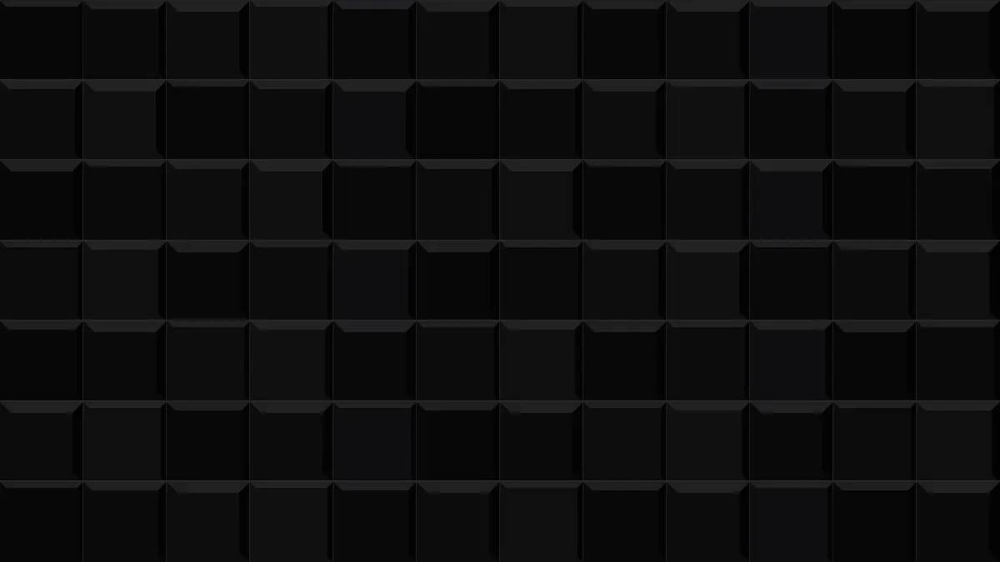

  

  Computer Engineering graduate (2025). 
  Building low-latency Web3 systems, mobile products, and applied AI workflows.

  <code>Swift</code> · <code>TypeScript</code> · <code>Python</code> · <code>Node.js</code> · <code>React Native</code>

  <a href="https://github.com/MustqfaKara/NERAXON">NERAXON</a> ·
  <a href="https://github.com/MustqfaKara/web3-tracker">web3-tracker</a>

