<p align="center">
  
</p>

<p align="center">
  <a href="https://github.com/MustqfaKara?tab=followers"></a>
  
  
</p>

## Merhaba, ben Mustafa

2025 Bilgisayar Mühendisliği mezunuyum. Milisaniyelerin önemli olduğu Web3 otomasyonları, zincir üstü veri sistemleri ve gerçek ürünlere dönüşen yapay zekâ iş akışları geliştiriyorum. Bir sistemi yalnızca çalıştırmakla yetinmeyip ölçmeyi, darboğazlarını bulmayı ve daha güvenilir hâle getirmeyi seviyorum.

<table>
  <tr>
    <td width="50%" valign="top">
      <h3>⚡ Sistem mühendisliği</h3>
      <p>Düşük gecikmeli event akışları, WebSocket sistemleri, paralel RPC stratejileri, güvenli işlem hazırlama ve gözlemlenebilir backend mimarileri.</p>
    </td>
    <td width="50%" valign="top">
      <h3>⛓️ Web3 ve veri</h3>
      <p>EVM ve Solana ekosistemlerinde zincir analizi, cüzdan davranışı, NFT altyapıları ve otomasyon odaklı araçlar.</p>
    </td>
  </tr>
  <tr>
    <td width="50%" valign="top">
      <h3>📱 Ürün geliştirme</h3>
      <p>Swift, SwiftUI ve React Native ile sade arayüzlü, performans odaklı mobil ürünler.</p>
    </td>
    <td width="50%" valign="top">
      <h3>✦ Üretken yapay zekâ</h3>
      <p>Flux ve Kling tabanlı üretim akışları, tutarlı karakterler için LoRA eğitimi ve modele dayalı otomasyonlar.</p>
    </td>
  </tr>
</table>

## Teknoloji yığını

<p>
  
  
  
  
  
  
  
  
  
</p>

## Öne çıkan çalışmalar

- **[NERAXON](https://github.com/MustqfaKara/NERAXON)** — Modüler EVM cüzdan zekâsı ve otomasyon mimarisi.
- **[web3-tracker](https://github.com/MustqfaKara/web3-tracker)** — Web3 verilerini izlemeye yönelik JavaScript araçları.
- **[find-country-and-gender-with-name](https://github.com/MustqfaKara/find-country-and-gender-with-name)** — TypeScript ile isim tabanlı veri sınıflandırma deneyi.

## Şu anda neyin peşindeyim?

```text
ölç → darboğazı bul → güvenli biçimde hızlandır → üretimde doğrula
```

Özellikle düşük gecikmeli dağıtık sistemler, on-chain veri zekâsı ve yapay zekâ destekli geliştirici araçları üzerine çalışıyorum.

<p align="center">
  <sub>İyi sistemler yalnız hızlı değildir; neden hızlı olduklarını da anlatabilir.</sub>
</p>
